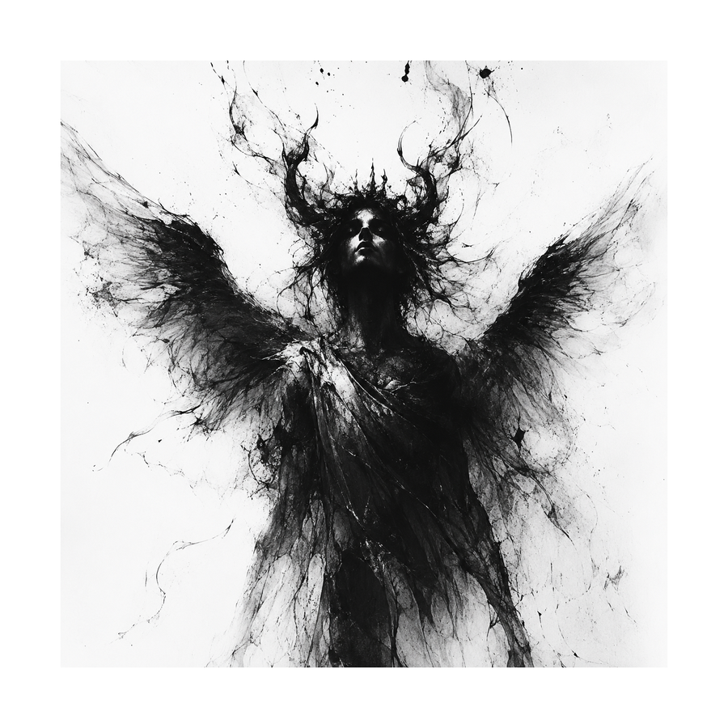

<!--
  ============================================================
  BUGSY HEWITT - GitHub profile README
  ------------------------------------------------------------
  1. Repo must be named exactly:  bugsyhewitt
  2. This file goes in as:  README.md
  3. Add image files beside it:  hero.png  +  hero-dark.png
     (matched pair - each has its background baked in, so the
     figure always reads in both GitHub light and dark mode)
  ============================================================
-->

<div align="center">

<picture>
  <source media="(prefers-color-scheme: dark)" srcset="hero-dark.png">
  
</picture>

&nbsp;

```
B U G S Y   H E W I T T
```

### ✦ &nbsp; D I G I T A L &nbsp;&nbsp; N E C R O M A N C E R &nbsp; ✦

<sub>BUG BOUNTY HUNTER &nbsp;·&nbsp; OFFENSIVE SECURITY RESEARCHER &nbsp;·&nbsp; BUILDER</sub>

&nbsp;

### ▸ &nbsp; [ &nbsp;E N T E R &nbsp;&nbsp; T H E &nbsp;&nbsp; F U L L &nbsp;&nbsp; S I T E&nbsp; ](https://bugsyhewitt.github.io) &nbsp; ◂

&nbsp;

[](https://instagram.com/bugsyhewitt)
[](https://github.com/bugsyhewitt)
[](https://discord.com)
[](mailto:bugsyhewitt@gmail.com)

&nbsp;

<sub>STATUS: OPERATIONAL &nbsp;·&nbsp; USA &nbsp;·&nbsp; MMXXVI</sub>

</div>
